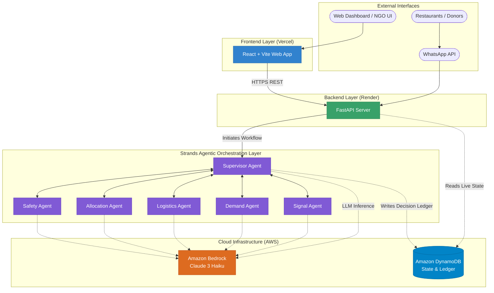

# AnnaSetu — Autonomous Food-Rescue Coordination Agent

> **Track:** Good Neighbor Agents (AWS Agents for Humans Hackathon)

AnnaSetu is an autonomous coordination system designed to rescue surplus food from donors and seamlessly match it with community organizations. It actively monitors for donor reports, checks recipient capacity, handles logistics by engaging riders, and continuously re-plans whenever disruptions occur—all while enforcing deterministic safety boundaries (AnnaGuard) over its multi-agent Strands Bedrock workflow.

## The Problem
Food surplus events are time-critical and unpredictable. When a restaurant has 45 meals remaining after service, they must coordinate safe transport and recipient availability within a narrow window before the food expires. Expecting humans to manually cross-reference driver availability and charity capacity in a panic leads to wasted food.

## Target Users
1. **Donors (Restaurants, Caterers):** Report surplus quickly via natural language (e.g. WhatsApp).
2. **Community Kitchens (Recipients):** Update their active capacity and operating hours.
3. **Delivery Partners (Riders):** Accept dynamic routing for food rescue.
4. **Operations Hub (Human Operators):** Handle tied allocations or explicit safety blocks generated by the deterministic control plane.

## Technical Architecture

AnnaSetu is built on a scalable, decoupled architecture utilizing a React frontend and a Python FastAPI backend, all orchestrated by Amazon Bedrock.



### Multi-Agent Swarm (Strands SDK)
The core logic is driven by a swarm of specialized agents, orchestrated by a Supervisor:
1. **Signal Agent:** Parses incoming natural-language text (e.g., WhatsApp) into strongly-typed `SurplusDraft` schemas.
2. **Supervisor Agent:** Orchestrates the workflow, delegating tasks to sub-agents and handling state transitions.
3. **Demand Agent:** Tracks NGO capacity and matches surplus food to the most appropriate recipient.
4. **Logistics Agent:** Calculates real-time ETAs and manages rider assignments.
5. **Allocation Agent:** Generates optimal allocation plans combining demand and logistics data.
6. **Safety Agent (AnnaGuard):** A deterministic policy engine. It calculates safety margins based on food type expiration and travel ETAs. It strictly blocks any LLM-proposed route that violates health codes.

### AWS Services Utilized
- **Amazon Bedrock:** Core inference engine powering all Strands Agents (`anthropic.claude-3-haiku-20240307-v1:0`).
- **Amazon DynamoDB:** Handles durable state, vendor/NGO profiles, active plans, and the auditable decision ledger (`AnnaSetuStateTable`).

## Running Locally

To run the full simulation dashboard and backend locally:

```bash
# 1. Install Backend
cd backend
python -m venv .venv
source .venv/bin/activate  # On Windows: .venv\Scripts\activate
pip install -r requirements.txt boto3 pytest
export MOCK_AWS=false  # Set to true to bypass AWS completely
export PYTHONPATH=.
python main.py

# 2. Install & Start Frontend (in a new terminal)
cd frontend
npm install
npm run dev
```

## Deployment (Hackathon Ready)

The project is fully containerized and decoupled for easy deployment on free-tier platforms:
1. **Backend (Render):** Deploy the `backend/Dockerfile` as a Web Service. Ensure `AWS_ACCESS_KEY_ID`, `AWS_SECRET_ACCESS_KEY`, `AWS_DEFAULT_REGION`, and `MOCK_AWS=false` are set in the environment variables.
2. **Frontend (Vercel):** Deploy the `frontend/` directory. Set `VITE_API_BASE=https://<your-render-url>.onrender.com/api` as a `Config` (public) environment variable.

*(An AWS CDK stack is also included in `/infrastructure` for full production enterprise deployment to AWS App Runner & CloudFront).*

## Guided Demo Scenarios

The web application exposes `/demo` trigger buttons demonstrating the AI's edge-case handling:
1. **Normal Rescue:** Immediate extraction, allocation, and assignment.
2. **Rider Failure → Re-plan:** An assigned rider drops out; the system automatically re-evaluates capacity and reassigns without human intervention.
3. **Safety Block:** An LLM-proposed route takes too long. AnnaGuard catches the violation, prevents assignment, and flags the plan for operator review in the "Human Inbox".
4. **Missing Details:** Donor forgets to state the quantity; the AI flags the missing requirements rather than hallucinating facts. 
